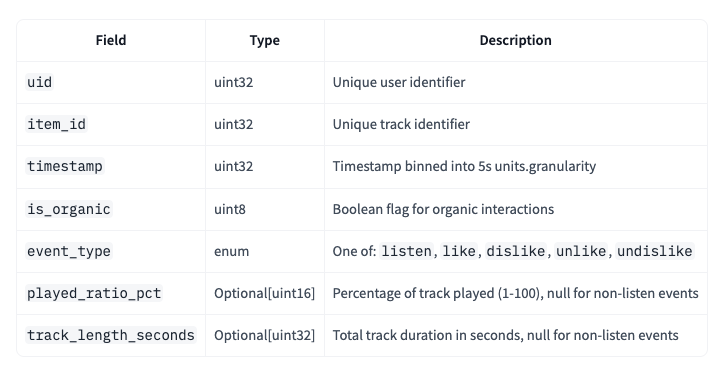

# Отчёт по проекту

**Студент:** Мамашакиров Нуртилек Жанабидинович
**Группа:** БИВ238

---

## 1. Введение и постановка задачи

- **Цель проекта:** предсказываем релевантную музыку для пользователей "Яндекс Музыки"
- **Формулировка задачи:** ранжирование
- **Обоснование метрики качества:** Были выбраны NDCG@10 и MAP@10, так они являются стандартами в задаче ранжирования (в частности в рекомендациях). @10 была выбрана, так как 10 – оптимальный размер батча рекомендаций.

---

## 2. Поиск и описание данных

- **Источник данных:** [Yambda](https://huggingface.co/datasets/yandex/yambda), открытый анонмизированный датасет от Яндекса
- **Описание датасета:**
  - Объём: 46,467,212 строк, 7 столбцов
  - Описание признаков
  

---

## 3. Обработка и подготовка данных

- **Полная очистка:**
  - Пропуски: как обнаружены, стратегия заполнения/удаления
  - Дубликаты: отсутсвуют
  - Выбросы: в рекомендациях нет понятия "выбросы"
  - Типы данных: float
- **Работа с фичами:**
  - Исходное количество признаков – 2
  - Созданы als-фичи, counter-фичи, которые и были в основе тяжелого ранжирования
- **Визуализации:** графики, отражающие распределения, зависимости между признаками и целевой переменной
- **Сплит данных:**
  - Стратегия разбиения train/test в отношение 0.8/0.2
  - Data leakage избегался с помощью timesplit-а

---

## 4. Baseline-модель

- **Модель:** ALS on listen
- **Результаты:** NDCG@10 = 0.096
- **Цель:** точка отсчёта для сравнения с более сложными моделями

---

## 5. Эксперименты

Для каждого эксперимента - формат: **Гипотеза** → **Как проверялось** → **Результат** + метрики в таблице.

- **Минимум 4–5 моделей** + ансамбли (RandomForest, XGBoost/LightGBM и др.)
- **Перебор гиперпараметров:** какие методы использовались и какие параметры перебирали
- **Уменьшение размерности:** если фич много - эксперименты с PCA/другими методами, визуализация
- **Таблица экспериментов:** пример как может выглядеть таблица

| Модель | Параметры | NDCG@10 | MAP@10 |  Гипотеза | Комментарий |
|--------|----------|-----------|-----------|-----------|-------------|
| TwoStage (CanGen + CatBoost)  | depth=6, iteration=500      | 0.103      | 0.050       | ...       | ...         |
| ALS on listen  | reg=0.1      |   0.096      | 0.046       | ...       |          |
| ALS on likes  |  reg=0.1      | 0.065       | 0.029      |      | ...         |
| ALS hybrid  | reg=0.1       | 0.096      | 0.046       |       | ...         |
| TopPop on listen  |  -     | 0.130      |   0.081    |      | ...         |

---

## 6. Финальная модель и интерпретируемость

- **Обоснование выбора финальной модели:** В качестве финальной модели был выбран двухстадийный ранкер, который использует легковесные модели для кандидатогенерации и выполняет тяжелое ранжирование CatBoost-моделью, она выигрывает по метрикам у ALS-моделей, однако проигрывает TopPop-модели, что объясняется большим bias-ом на популярные треки в Яндекс Музыке. Основным преимуществом двухстадийной рек системы перед TopPop является персонализация.
- **Интерпретируемость:** важность признаков (feature importance), коэффициенты - что можно сказать о влиянии фич на предсказание

---

## 7. Деплой

- **Интерфейс:** если требуется по задаче (Streamlit, Telegram-бот и т.д.)
- **API:** FastAPI или аналог - описание эндпоинтов, примеры запросов
- **Скриншоты** работы интерфейса/API
- **Ссылка на видео** демонстрации работы

---

## 8. Заключение и выводы

- **Итоги:** достигнутые результаты, сравнение с baseline
- **Ограничения:** что не удалось, почему
- **Возможные улучшения:** идеи для дальнейшей работы
